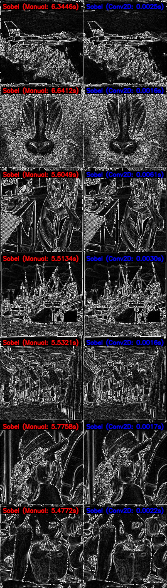
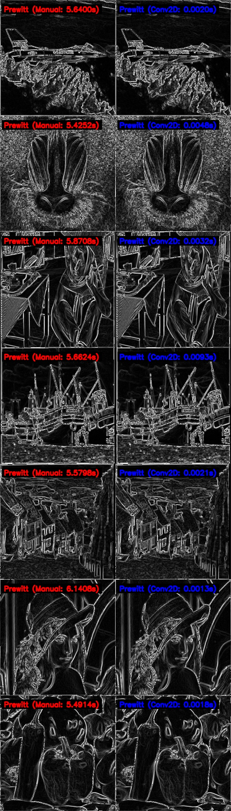
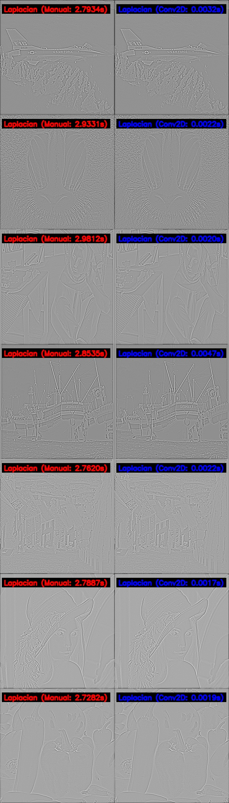
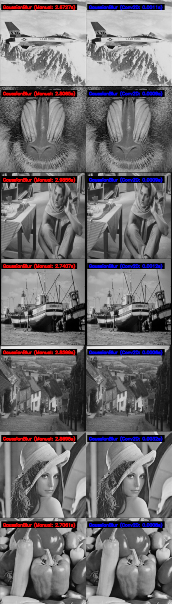
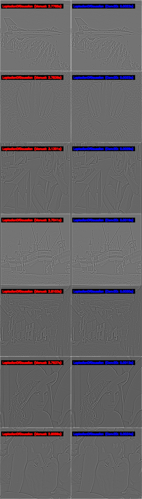
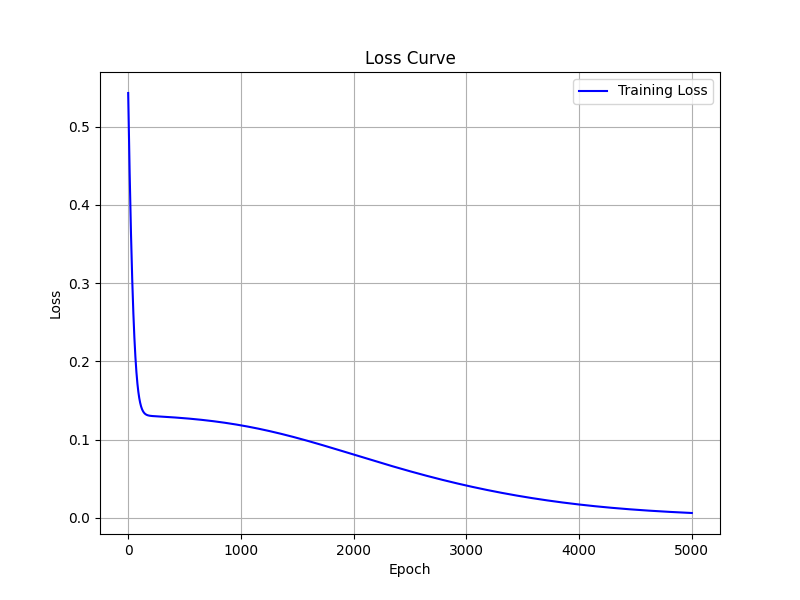
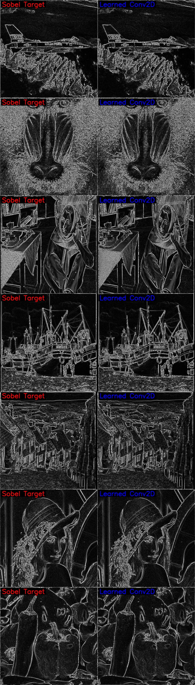
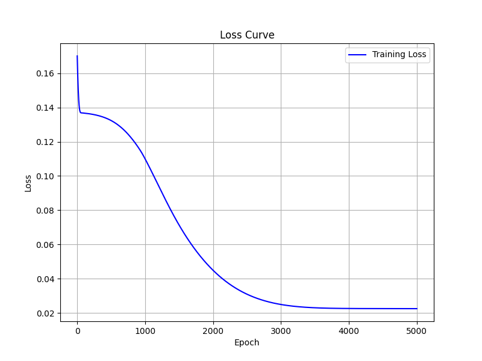
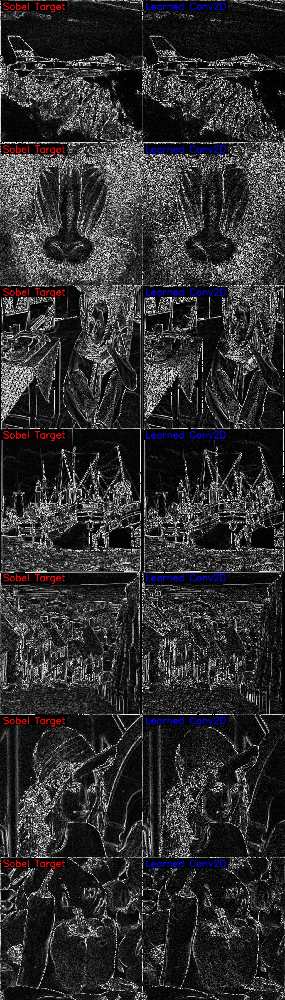

# Old school filters with Pytorch

#### **Classic Image Filters and CNN Training with PyTorch**  

### **What is this?**  
explores the connection between 
* **traditional image processing filters**
* **CNN-based feature extraction** using PyTorch

1️⃣ **Implementing classic filters** (Sobel, Prewitt, Laplacian, Gaussian, LoG) with PyTorch.  
2️⃣ **Training a CNN to show its similarity to traditional filters by learning the Sobel filter.**  

---

## **How to Run?**  

#### **1️⃣ Apply Traditional Filters**  
```bash
python main.py
```
- Loads test images (`test_images/`).  
- Applies **manual & `conv2d` implementations** of classic filters.  

#### **2️⃣ Train a CNN to Learn Sobel**  
```bash
python main_train.py
```
- Trains a CNN to approximate the Sobel filter.  
- Demonstrates that CNNs can learn traditional filters.  
- Saves **loss curve (`loss_curve.png`)** and **learned filter**.  

---

## **Results**  
### Manual(for loop) imple ⚔️ torchvision's conv2d
<details>
<summary> Sobel </summary>



</details>

<details>
<summary> Prewitt </summary>



</details>

<details>
<summary> Laplacian </summary>



</details>

<details>
<summary> GaussianBlur </summary>



</details>

<details>
<summary> LaplacianOfGaussian </summary>



</details>

### Can 'Learning' mimic traditional filters?

#### Training Loss


#### Trained Sobel Filter
```
Learned Kernel:
 [[[-1.7841239e-01 -1.3419280e+00 -2.0839319e+00]
  [ 1.0279056e+00  3.1480375e-01 -1.2704699e+00]
  [ 2.2240264e+00  1.3061274e+00  1.4422949e-03]]

 [[-8.7746859e-01 -6.8865216e-01  4.3462253e-01]
  [-8.2342613e-01 -1.9852407e-01  6.1364716e-01]
  [-2.8820539e-01  6.7039949e-01  1.1550015e+00]]]
```
* Trained Sobel looks different from the original filter form.
* However, if you look a little more, it is a rotated filter of Original Sobel.

<details>
<summary> Origial ⚔️ Trained  </summary>



</details>

### Make small verson of Sobel with 'Learning'



#### Trained Sobel Filter
```
Learned Kernel:
 [[ 0.00956989  1.5808742   2.1380332 ]
 [-1.8604777   0.07029653  1.7490406 ]
 [-2.123877   -1.6290201   0.06313752]]
```
* It looks like one of filter of Sobel but rotated.
* However, the results calculated with this kernel are quite similar to Sobel's.

<details>
<summary> Origial ⚔️ Trained  </summary>



</details>
